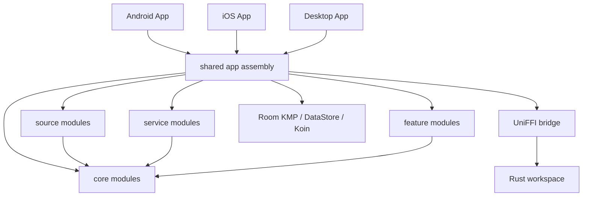

# TidePlayer

[简体中文](./README.md) · English

TidePlayer is a local-first private music collection player built with Kotlin Multiplatform, Compose Multiplatform, Rust, and UniFFI. It provides one shared music library across Android, iOS, and Desktop while keeping transient playback resources, credentials, and provider-specific details behind explicit source boundaries.

> [!NOTE]
> The current product name is **TidePlayer**. The project was previously published as **MelodyTrove** and, earlier, **TideTunes**. Existing installs, data directories, settings backups, and deep links remain supported by compatibility migration code.

> [!IMPORTANT]
> TidePlayer is under active development. Release versions follow Git tags, while development builds include the commit count and short SHA. User-facing behavior, database migrations, and extension APIs may continue to evolve before the stable release.

## Highlights

- **Android, iOS, and Desktop** from a shared Kotlin and Compose codebase.
- **Local, WebDAV, and SMB2/3 music sources** with browsing, indexed search, streaming, and downloads.
- **Room KMP canonical library** for tracks, albums, artists, genres, artwork, lyrics, playlists, downloads, and sync state.
- **Adaptive UI** with bottom navigation on phones, navigation rail on medium windows, and sidebar layouts on large/desktop screens.
- **Cross-platform playback abstraction** backed by Android Media3, iOS AVPlayer, and a Rust/rodio Desktop engine.
- **One shared Rust software DSP** for Android Media3 PCM, iOS AVPlayer processing taps, and Desktop rodio, with live graphic/parametric EQ and advanced effects.
- Offline downloads through Android WorkManager, iOS background URLSession, and a Desktop coroutine scheduler.
- Fast, Standard, and Full metadata scan modes for WebDAV and SMB.
- JavaScript metadata plugins compatible with Lyrico Plugin API v1-v3, executed in isolated QuickJS runtimes.
- Rust backend for remote storage, metadata parsing, plugin execution, Desktop playback support, and UniFFI bindings.

## Current features

### Music library and browsing

- Home, Search, Library, and Settings top-level destinations.
- Track, album, artist, genre, playlist, recently added, recently played, radio, queue, lyrics, and now-playing screens.
- Room-backed full-text library search and source-scoped provider search.
- Canonical tracks that may reference multiple playable source items.
- Persistent playlists with stable ordering.
- Embedded and sidecar lyrics, artwork metadata, and raw audio tags.
- Responsive navigation across phones, tablets, large screens, and Desktop windows.

### Music sources

| Source | Browse | Search | Stream | Download | Incremental sync |
| --- | :---: | :---: | :---: | :---: | :---: |
| Local | Yes | Yes | Yes | Yes | Not yet |
| WebDAV | Yes | Yes | Yes | Yes | Not yet |
| SMB2/3 | Yes | Yes | Yes | Yes | Not yet |

Source adapters authenticate, browse, search, and resolve playback resources. They do not write directly to canonical music tables.

### Remote metadata scan modes

| Mode | Behavior |
| --- | --- |
| **Fast** | Reads core tags and audio properties, detects embedded artwork and embedded lyric kind without extracting either payload, and skips lyric content and raw tags. |
| **Standard** | Reads core tags, audio properties, and embedded lyrics; detects embedded artwork without extracting/caching the image; classifies lyrics as plain, line-timed, word-timed, or TTML. This is the default for new installs. |
| **Full** | Reads core tags, audio properties, artwork, lyrics, and raw metadata. |

Skipped optional metadata is preserved rather than deleted. Missing artwork or lyrics can be backfilled later from Settings without requiring the remote file fingerprint to change.

Fast and Standard persist per-source artwork presence and embedded-lyrics kind in `track_source_ref` without storing image bytes or, in Fast mode, lyric content in Room. Seekable formats such as MP3, M4A/MP4, FLAC, APE/WavPack, and ID3 inside WAV/AIFF can skip image payloads. Ogg/Opus artwork is often embedded inside Vorbis Comment packets, so the containing comment packet may still need to be read.

When external word-timed or TTML lyrics are ranked ahead of an available plain-lyrics fallback, playback performs one best-effort automatic Lyrico lookup. Scanning never invokes plugins, and audio startup does not wait for the lookup.

### Playback and downloads

- Shared playback state, position, queue, play mode, and now-playing contracts.
- Playback URLs, headers, cookies, and expiring tokens are resolved immediately before playback and are not persisted in Room.
- Android playback through Media3 and MediaSession.
- iOS playback through an AVPlayer-backed engine adapter.
- Desktop playback through the Rust/rodio backend.
- Persistent download tasks with pause, resume, retry, cancel, and progress state.
- Platform schedulers: Android WorkManager, iOS background URLSession, and Desktop coroutines.

### Lyrico-compatible metadata plugins

TidePlayer supports user-supplied ZIP plugins implementing Lyrico Plugin API v1-v3 `MetaSource` behavior. Plugins extend metadata, cover, and lyric lookup and remain separate from playback `MusicSource` providers.

```text
Plugin ZIP
  -> validation and bounded extraction
  -> Room-backed installation and configuration
  -> observable MetaSource registry
  -> lazy isolated QuickJS worker
  -> searchSongs / getLyrics / searchCovers
  -> normalized TidePlayer metadata results
```

Implemented plugin capabilities include ZIP import, manifest validation, update, enable/disable, configuration, cache clearing, uninstall, v3 config-field behavior, manual/automatic/batch permissions, structured and translated lyrics, runtime isolation, resource limits, Host APIs, redirect/private-network checks, response-size limits, and sensitive-log filtering.

TidePlayer does not bundle or automatically download third-party plugin ZIPs. See [Plugin Runtime](./docs/plugin-runtime.md) for the compatibility and security model.

## Architecture



Core architecture rules:

1. Android, iOS, and Desktop share one UI-facing Room KMP schema.
2. Canonical library entities are provider-independent.
3. Source identity and provider-specific state are stored separately.
4. Signed URLs, headers, tokens, cookies, and temporary loopback URLs are resolved at playback time and are not canonical track metadata.
5. Feature code depends on contracts rather than Media3, AVPlayer, rodio, Room, or UniFFI implementations.
6. Metadata plugins implement `MetaSource`; Local, WebDAV, and SMB implement playback/browsing through `MusicSource`.

Detailed documents:

- [Architecture report](./docs/architecture/final-architecture.md)
- [Room KMP schema](./docs/database/schema.md)
- [SMB music source](./docs/music-sources/smb.md)
- [Plugin runtime](./docs/plugin-runtime.md)
- [Shared DSP architecture](./docs/audio/dsp-architecture.md)
- [DSP effects and parameters](./docs/audio/dsp-effects.md)
- [DSP platform support and benchmarks](./docs/audio/dsp-platform-support.md)
- [Test report](./docs/testing/test-report.md)

## Repository structure

```text
TidePlayer/
├── androidApp/                  Android application entry point
├── desktopApp/                  Desktop JVM application entry point
├── iosApp/                      SwiftUI container and Xcode project
├── shared/                      App assembly, navigation, DI, Room, data layer, platform actuals
├── core/                        Domain, presentation, lyric core and lyric UI
├── source/                      MusicSource API plus Local/WebDAV/SMB providers
├── service/                     Playback, download and library-sync layers
├── feature/                     Home, library, search, settings, sources, playlists, etc.
├── rust-libs/                   DSP, app backend, storage, metadata, plugins and ordering crates
├── build-logic/convention/      Gradle convention plugins
├── docs/                        Architecture, schema, runtime and testing documents
├── Design/                      UI design references and generated design assets
└── gradle/libs.versions.toml    Dependency and plugin version catalog
```

## Technology stack

| Area | Technologies |
| --- | --- |
| Shared language | Kotlin 2.4, Kotlin Multiplatform |
| UI | Compose Multiplatform, JetBrains Navigation Compose, Miuix |
| Dependency injection | Koin |
| Persistence | Room KMP, bundled SQLite, DataStore |
| Concurrency/serialization | Coroutines, kotlinx.serialization, kotlinx.datetime |
| Android playback | AndroidX Media3 / MediaSession |
| iOS host | SwiftUI, UIKit bridge, AVPlayer engine adapter |
| Desktop | Compose Desktop, JVM 21, Rust/rodio playback |
| Native backend | Rust, UniFFI, Gobley Gradle integration |
| Plugins | QuickJS JavaScript runtime, Lyrico Plugin API v1-v3 |
| CI | GitHub Actions, Gradle, Cargo |

## Requirements

Common tooling:

- Git
- JDK 21
- Rust stable and Cargo
- A recent Android Studio or IntelliJ IDEA with Kotlin Multiplatform support

Android additionally requires Android SDK Platform 37, compatible Build Tools, an Android NDK (CI currently uses `r28-beta2`), and Android Rust targets:

```bash
rustup target add aarch64-linux-android x86_64-linux-android
cargo install --locked cargo-ndk@3.5.4
```

The Android app uses `minSdk 29`, `targetSdk 34`, and `compileSdk 37`.

iOS requires macOS, Xcode, iOS 16.0+, and arm64 device/simulator targets. The Gradle project defines `iosArm64` and `iosSimulatorArm64`; x86_64 Simulator is not configured.

Linux Desktop builds require ALSA development headers and `pkg-config`:

```bash
sudo apt-get update
sudo apt-get install --yes libasound2-dev pkg-config
```

## Build from source

```bash
git clone https://github.com/JulyStar-Lv/TidePlayer.git
cd TidePlayer
```

Android:

```bash
./gradlew :androidApp:assembleDebug
```

Desktop:

```bash
./gradlew :desktopApp:run
./gradlew :desktopApp:compileKotlinDesktop :shared:desktopTest
./gradlew :desktopApp:packageDistributionForCurrentOS
```

iOS:

```bash
open iosApp/App.xcodeproj
```

Rust workspace:

```bash
cargo fmt --manifest-path rust-libs/Cargo.toml --all -- --check
cargo clippy --manifest-path rust-libs/Cargo.toml --workspace --all-targets -- -D warnings
cargo test --manifest-path rust-libs/Cargo.toml --workspace
```

## Tests and CI

Common local checks:

```bash
./gradlew test
./gradlew :shared:desktopTest
./gradlew :shared:testDebugUnitTest
./gradlew :shared:iosSimulatorArm64Test
./gradlew \
  :shared:compileDebugKotlinAndroid \
  :desktopApp:compileKotlinDesktop \
  :shared:compileKotlinIosSimulatorArm64
```

Live WebDAV tests require credentials supplied only at runtime. Never commit secrets.

## Brand and compatibility identifiers

The current product brand is **TidePlayer**. Stable technical identifiers remain brand-neutral to avoid repeating migration work on future product-name changes:

| Area | Current identifier |
| --- | --- |
| Kotlin/Java root package | `io.github.julystar.musicapp` |
| Android application ID | `io.github.julystar.musicapp` |
| iOS bundle ID | `io.github.julystar.musicapp` |
| Apple shared framework | `SharedKit` |
| Rust / UniFFI | `app-backend` / `app_backend` / `uniffi.app_backend` |
| Database | `library.db` |
| Preferences | `settings.preferences_pb` |
| Desktop data directory | platform data directory / `TidePlayer` |
| Primary deep-link scheme | `tideplayer` |

`MelodyTrove` and `TideTunes` remain only as historical compatibility identifiers. See:

- [Brand naming policy](./docs/branding/naming-policy.md)
- [Legacy identifiers](./docs/branding/legacy-identifiers.md)
- [External migration checklist](./docs/branding/external-migration-checklist.md)

## Development conventions

- Pure domain models must not depend on Compose, Room, Media3, AVFoundation, rodio, or UniFFI types.
- Provider-specific fields belong to source entities/properties rather than canonical `track`.
- Expiring playback resources must be resolved at the playback boundary.
- UI features should prefer immutable state and explicit action/event contracts.
- Every Room schema change requires a migration and updated exported schema.
- Never commit WebDAV passwords, OAuth tokens, plugin secrets, signing files, or third-party plugin ZIPs.
- Run the relevant Gradle, Cargo, branding, and HMI i18n checks before opening a pull request.

## Current limitations

- The project is still pre-stable; all behavior is not guaranteed to remain compatible across development builds.
- iOS Simulator support is currently arm64 only.
- Third-party Lyrico plugin ZIPs are user supplied; TidePlayer does not distribute them.
- Configured include directories are bundled deterministically; runtime `include(path)` is intentionally disabled so plugins cannot read arbitrary local files.
- Android normal production-process exit relies on operating-system process cleanup.

## Roadmap

Near-term work includes improving real Lyrico plugin compatibility and diagnostics, accelerating large-library import/sync/metadata backfill, refining adaptive UI and accessibility, adding source providers and synchronization capabilities, and improving release packaging and end-user documentation.

## Contributing

Issues and pull requests are welcome. Changes should preserve module/dependency boundaries, include or update tests for behavioral changes, run relevant Gradle/Cargo checks, document database/plugin/source/platform changes, and never include private credentials, copyrighted plugin packages, or personal music-library data.

## License

Most TidePlayer code is licensed under [GNU General Public License v3.0](./LICENSE.md).

The [`order-key`](./rust-libs/order-key) crate is available under either Apache License 2.0 or MIT License terms.
