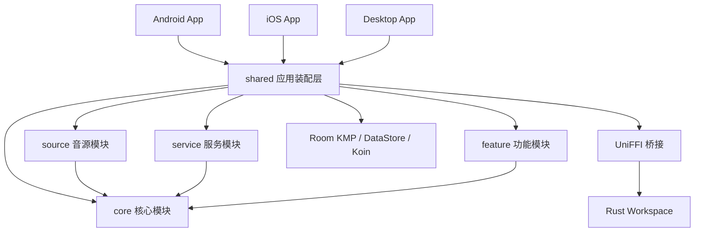

# TidePlayer

TidePlayer 是一款使用 Kotlin Multiplatform、Compose Multiplatform、Rust 和 UniFFI 构建的**本地优先、私人音乐收藏播放器**。项目面向 Android、iOS 和 Desktop 提供统一音乐库，并通过清晰的音源边界隔离临时播放资源、账号凭据和 Provider 特有数据。
> [!IMPORTANT]
> TidePlayer 仍在积极开发中。发布版本跟随 Git 标签，开发版本会包含提交数和短 SHA；在稳定版本发布前，用户界面、数据库迁移和扩展 API 仍可能继续调整。

## 项目亮点

- 使用同一套 Kotlin 与 Compose 代码支持 **Android、iOS 和 Desktop**。
- 支持 **本地、WebDAV 和 SMB2/3 音源**，具备目录浏览、索引搜索、在线播放和下载能力。
- 使用 **Room KMP 统一曲库** 管理曲目、专辑、艺术家、流派、封面、歌词、播放列表、下载和同步状态。
- 提供 **自适应界面**：手机使用底部导航，中等窗口使用导航栏，大屏和桌面使用侧边栏布局。
- 使用统一播放抽象，并分别接入 Android Media3、iOS AVPlayer 和 Desktop Rust/rodio 播放引擎。
- Android Media3 PCM、iOS AVPlayer Processing Tap 和 Desktop rodio 使用**同一套 Rust 软件 DSP**，支持实时 10 段/参数均衡与高级音效。
- 支持跨平台离线下载：Android WorkManager、iOS 后台 URLSession、Desktop 协程调度器。
- WebDAV 和 SMB 支持 Fast、Standard、Full 三种可选元数据扫描模式。
- 支持兼容 Lyrico Plugin API v1-v3 的 JavaScript 元数据插件，并在隔离的 QuickJS Runtime 中运行。
- Rust 后端负责远端存储、元数据解析、插件执行、桌面播放支持和 UniFFI 绑定。

## 当前功能

### 音乐库与浏览

- 首页、搜索、音乐库、设置四个一级入口。
- 支持曲目、专辑、艺术家、流派、播放列表、最近添加、最近播放、音乐电台、播放队列、歌词和正在播放页面。
- 基于 Room FTS 的本地曲库全文搜索，以及按音源账号索引的 Provider 搜索。
- 同一规范化曲目可以关联多个可播放来源文件。
- 播放列表持久化和稳定排序。
- 支持内嵌歌词、外挂歌词、封面元数据和原始音频标签。
- 支持手机、平板、大屏和桌面窗口的响应式导航布局。

### 音源支持

| 音源 | 浏览 | 搜索 | 播放 | 下载 | 增量同步 |
| --- | :---: | :---: | :---: | :---: | :---: |
| 本地 | 支持 | 支持 | 支持 | 支持 | 暂不支持 |
| WebDAV | 支持 | 支持 | 支持 | 支持 | 支持（RFC 6578 sync-token，安全回退全量扫描） |
| SMB2/3 | 支持 | 支持 | 支持 | 支持 | 暂不支持 |
| OneDrive | 支持 | 支持 | 支持 | 支持 | 支持（Delta） |
| Navidrome | 支持 | 支持 | 支持 | 支持 | 暂不支持 |
| OpenSubsonic | 支持 | 支持 | 支持 | 支持 | 暂不支持 |
| Emby | 支持 | 支持 | 支持 | 支持 | 暂不支持 |

音源适配器负责鉴权、浏览、搜索和解析播放资源，不会直接写入规范化音乐表。

### 远程音源元数据扫描模式

| 模式 | 行为 |
| --- | --- |
| **Fast** | 读取核心标签和音频属性，探测内嵌封面是否存在及内嵌歌词类型，但不提取两者载荷，并跳过歌词正文和原始标签。 |
| **Standard** | 读取核心标签、音频属性和内嵌歌词，探测是否存在内嵌封面但不提取或缓存图片，并把歌词分类为普通、逐行、逐字或 TTML。新安装默认使用此模式。 |
| **Full** | 读取核心标签、音频属性、封面、歌词和原始元数据。 |

被跳过的可选元数据不会被删除。用户可以之后在设置中补全缺失封面或歌词，无需伪造远端文件变更，也不要求文件指纹发生变化。

Fast/Standard 会把每个来源文件的封面存在状态和内嵌歌词类型保存到 `track_source_ref`，但不会把图片二进制写入 Room；Fast 也不会保存歌词正文。MP3、M4A/MP4、FLAC、APE/WavPack 以及 WAV/AIFF 内嵌 ID3 等可定位格式会直接跳过图片载荷；Ogg/Opus 的图片通常内联在 Vorbis Comment 数据包中，因此仍可能需要读取包含图片的注释数据包。

当用户把外部逐字歌词或 TTML 排在当前普通歌词之前时，播放器会在开始播放后尽力执行一次 Lyrico 自动查询。扫描发现 `hasEmbeddedArtwork=0` 时，会使用已授权批量查询的插件补全并缓存封面；播放当前无封面歌曲时也会使用已授权自动查询的插件。音频起播不会等待插件查询。

### 播放与下载

- 统一的播放状态、播放进度、队列、播放模式和正在播放展示契约。
- 播放 URL、请求头、Cookie 和短期 Token 只在实际播放前解析，不写入 Room。
- Android 使用 Media3 和 MediaSession。
- iOS 使用 AVPlayer、Processing Tap 和共享 Rust DSP；系统音频会话支持 AirPlay，设置页使用原生 `AVRoutePickerView` 并展示 `currentRoute`。锁屏、控制中心、蓝牙和 CarPlay Now Playing 使用 Now Playing/Remote Command；当前不提供完整 CarPlay 曲库浏览应用。
- Desktop 使用 Rust/rodio 播放后端；cpal 是输出设备列表与系统默认设备的唯一事实来源，切换设备时恢复曲目位置、播放/暂停状态、音量和 DSP。
- 下载任务持久化，支持暂停、继续、重试、取消和进度更新。
- 平台下载调度器：Android WorkManager、iOS 后台 URLSession、Desktop 协程调度器。

### 兼容 Lyrico 的元数据插件

TidePlayer 支持用户从本地导入实现 Lyrico Plugin API v1-v3 `MetaSource` 行为的 ZIP 插件。插件用于扩展歌曲元数据、封面和歌词查询，不会被当作通用播放 `MusicSource` 使用。

当前插件链路：

```text
插件 ZIP
  -> 校验与受限解压
  -> 基于 Room 的安装、配置和持久化
  -> 可观察的 MetaSource 注册表
  -> 延迟创建的独立 QuickJS Worker
  -> searchSongs / getLyrics / searchCovers
  -> 统一的 TidePlayer 元数据结果
```

已经实现的插件能力包括：

- ZIP 导入、manifest 校验、更新、启用/禁用、配置、清理缓存和卸载。
- Lyrico v3 官方配置字段类型和条件显示。
- 手动、自动和批量查询权限。
- 结构化歌词、翻译歌词、罗马音歌词和多种原始歌词格式。
- 兼容真实 Lyrico 插件常见的歌曲、封面结果包装和字段别名。
- 每个插件独立 Runtime、内存/栈限制、超时、取消和中毒 Runtime 重建。
- 提供 HTTP、缓存、加密、Base64、字节、压缩、XML、日志、应用和运行时信息 Host API。
- HTTP 重定向和私有网络校验、响应大小限制，以及敏感日志过滤。

TidePlayer 不内置或自动下载第三方插件 ZIP，插件文件由用户自行提供。详细兼容性和安全模型请参阅[插件运行时文档](./docs/plugin-runtime.md)。

## 架构



### 架构原则

1. **一个面向 UI 的统一数据库**：Android、iOS 和 Desktop 使用同一套 Room KMP Schema，并统一使用 bundled SQLite。
2. **规范化曲库与 Provider 无关**：曲目、专辑、艺术家、流派、歌词、封面、播放列表和下载记录不归属于某个特定 Provider。
3. **音源身份单独保存**：音源账号、曲库根目录、来源对象、同步游标、Provider 扩展属性和曲目来源引用单独建模。
4. **临时播放资源不属于曲目元数据**：签名 URL、HTTP 请求头、Token、Cookie 和临时回环地址在播放时动态解析，不作为曲目字段持久化。
5. **功能模块依赖契约，而不是平台播放引擎**：commonMain 仅使用播放、下载、同步、音源和 Repository 接口；Media3、AVPlayer、rodio、Room 和 UniFFI 保留在平台层或数据边界。
6. **元数据插件不是播放音源**：JavaScript 插件通过 `MetaSource` 提供元数据查询；本地、WebDAV 和 SMB 通过 `MusicSource` 提供浏览和播放。

详细文档：

- [架构报告](./docs/architecture/final-architecture.md)
- [下载文件最终化](./docs/architecture/download-finalization.md)
- [Android 备份与恢复策略](./docs/platform/android-backup-policy.md)
- [Room KMP 数据库结构](./docs/database/schema.md)
- [SMB 音源](./docs/music-sources/smb.md)
- [插件运行时](./docs/plugin-runtime.md)
- [共享 DSP 架构](./docs/audio/dsp-architecture.md)
- [DSP 效果与参数](./docs/audio/dsp-effects.md)
- [DSP 平台支持与基准](./docs/audio/dsp-platform-support.md)
- [测试报告](./docs/testing/test-report.md)

## 仓库结构

```text
TidePlayer/
├── androidApp/                  Android 应用入口
├── desktopApp/                  Desktop JVM 应用入口
├── iosApp/                      SwiftUI 容器与 Xcode 工程
├── shared/                      应用装配、导航、DI、Room、主要数据层和平台 actual
├── core/
│   ├── data/                    稳定、跨平台的数据实现（当前含 UiMessage 总线）
│   ├── domain/                  纯领域模型和 Repository 契约
│   ├── presentation/            共享设计系统和展示层工具
│   ├── lyrics-core/             共享歌词模型与处理逻辑
│   └── lyrics-ui/               共享歌词 UI
├── source/
│   ├── api/                     MusicSource 契约和注册表
│   ├── local/                   本地音源适配器
│   ├── smb/                     SMB2/3 音源适配器
│   └── webdav/                  WebDAV 音源适配器
├── service/
│   ├── playback/domain/         播放引擎、控制器和队列契约
│   ├── playback/presentation/   正在播放和播放 UI 状态
│   ├── download/domain/         下载契约与 UseCase
│   ├── download/data/           持久化下载实现
│   ├── librarysync/domain/      曲库同步契约
│   └── librarysync/data/        同步持久化与协调逻辑
├── feature/                     首页、曲库、搜索、设置、音源、播放列表等功能
├── rust-libs/
│   ├── audio-dsp/               平台无关的实时 DSP 核心
│   ├── app-backend/             面向 UniFFI 的后端门面
│   ├── async-runtime/           Rust 异步运行时支持
│   ├── storage-backend/         远端存储和扫描
│   ├── audio-metadata/          音频元数据读取、临时写入与验证
│   ├── plugin-runtime/          QuickJS 插件 Host
│   ├── order-key/               稳定排序键
│   └── uniffi-bindgen/          UniFFI 绑定生成辅助工具
├── build-logic/convention/      Gradle Convention Plugin
├── docs/                        架构、数据库、运行时和测试文档
├── Design/                      UI 设计参考与生成的设计资源
└── gradle/libs.versions.toml    依赖和插件版本目录
```

## 技术栈

| 范围 | 技术 |
| --- | --- |
| 共享语言 | Kotlin 2.4、Kotlin Multiplatform |
| UI | Compose Multiplatform、JetBrains Navigation Compose、Miuix |
| 依赖注入 | Koin |
| 数据持久化 | Room KMP、bundled SQLite、DataStore |
| 并发与序列化 | Coroutines、kotlinx.serialization、kotlinx.datetime |
| Android 播放 | AndroidX Media3 / MediaSession |
| iOS 宿主 | SwiftUI、UIKit Bridge、AVPlayer 播放适配器 |
| Desktop | Compose Desktop、JVM 21、Rust/rodio 播放 |
| Native 后端 | Rust、UniFFI、Gobley Gradle 集成 |
| 插件 | QuickJS JavaScript Runtime、Lyrico Plugin API v1-v3 |
| CI | GitHub Actions、Gradle、Cargo |

## 开发环境要求

### 通用环境

- Git
- JDK 21
- Rust stable 工具链和 Cargo
- 较新的 Android Studio 或支持 Kotlin Multiplatform 的 IntelliJ IDEA

### Android

- Android SDK Platform 37 和兼容的 Build Tools
- 支持 Rust Android Target 的 Android NDK；当前 CI 使用 NDK `r28-beta2`
- Rust Android Target：

```bash
rustup target add aarch64-linux-android x86_64-linux-android
cargo install --locked cargo-ndk@3.5.4
```

Android 应用使用 `minSdk 29`、`targetSdk 34` 和 `compileSdk 37`。当前打包应用面向 `arm64-v8a`，共享 Native 构建还包含用于开发和测试的 `x86_64`。

### iOS

- macOS 和 Xcode
- iOS 16.0 或更高版本
- Apple Silicon，或 arm64 iOS Simulator 目标

Gradle 工程定义 `iosArm64` 和 `iosSimulatorArm64`，未配置 x86_64 Simulator Target。

### Linux Desktop

构建 Desktop 目标前需要安装 ALSA 开发头文件和 `pkg-config`：

```bash
sudo apt-get update
sudo apt-get install --yes libasound2-dev pkg-config
```

## 从源码构建

```bash
git clone https://github.com/JulyStar-Lv/TidePlayer.git
cd TidePlayer
```

开发构建版本格式为 `appVersionBase-dev.<提交数>+<短 SHA>`。`vX.Y.Z` 或 `pre-vX.Y.Z-beta.N` 标签会成为发布版本。外部构建可显式设置 `APP_VERSION_NAME` 和 `APP_VERSION_CODE`；运行 `./gradlew printAppVersion` 可以查看最终解析结果。

### Android

```bash
./gradlew :androidApp:assembleDebug
```

APK 输出目录为 `androidApp/build/outputs/apk/`。Release 构建需要配置 `androidApp/key.properties` 和有效签名密钥，请勿提交签名凭据。

### Desktop

```bash
./gradlew :desktopApp:run
./gradlew :desktopApp:compileKotlinDesktop :shared:desktopTest
./gradlew :desktopApp:packageDistributionForCurrentOS
```

Compose Desktop 已配置 DMG、MSI 和 DEB 输出格式。

### iOS

```bash
open iosApp/App.xcodeproj
```

选择 `App` Scheme 和 arm64 Simulator 或真机。Xcode Build Phase 会自动调用：

```bash
./gradlew :shared:embedAndSignAppleFrameworkForXcode
```

### Rust Workspace

```bash
cargo fmt --manifest-path rust-libs/Cargo.toml --all -- --check
cargo clippy --manifest-path rust-libs/Cargo.toml --workspace --all-targets -- -D warnings
cargo test --manifest-path rust-libs/Cargo.toml --workspace
```

## 测试与 CI

仓库 CI 会在推送到 `main` 或向 `main` 创建 Pull Request 时执行构建与检查。常用本地命令：

```bash
./gradlew test
./gradlew :shared:desktopTest
./gradlew :shared:testDebugUnitTest
./gradlew :shared:iosSimulatorArm64Test
./gradlew \
  :shared:compileDebugKotlinAndroid \
  :desktopApp:compileKotlinDesktop \
  :shared:compileKotlinIosSimulatorArm64
```

部分 WebDAV Live Test 需要运行时提供账号凭据，任何 Secret 都不得提交到仓库。

## 品牌与兼容标识

当前产品品牌为 **TidePlayer**。稳定技术标识继续使用品牌中立名称，以避免再次改名造成数据或 API 迁移：

| 范围 | 当前标识 |
| --- | --- |
| Kotlin/Java 根包 | `io.github.julystar.musicapp` |
| Android Application ID | `io.github.julystar.musicapp` |
| iOS Bundle ID | `io.github.julystar.musicapp` |
| Apple Shared Framework | `SharedKit` |
| Rust / UniFFI | `app-backend` / `app_backend` / `uniffi.app_backend` |
| 数据库 | `library.db` |
| Preferences | `settings.preferences_pb` |
| Desktop 数据目录 | 平台数据目录下的 `TidePlayer` |
| 主 Deep Link Scheme | `tideplayer` |

`MelodyTrove` 和 `TideTunes` 只作为历史兼容标识保留。详细规则见：

- [品牌命名规则](./docs/branding/naming-policy.md)
- [历史兼容标识](./docs/branding/legacy-identifiers.md)
- [外部迁移清单](./docs/branding/external-migration-checklist.md)

## 开发约定

- 纯领域模型不得依赖 Compose、Room、Media3、AVFoundation、rodio 或 UniFFI 类型。
- Provider 特有字段应保存到来源实体或来源对象扩展属性，不要直接加入规范化 `track`。
- 短期有效的播放资源必须在播放边界动态解析。
- 功能 UI 优先使用不可变 State 和明确的 Action/Event 契约。
- 每次 Room Schema 变更都必须提供 Migration，并更新导出的 Schema。
- 禁止提交 WebDAV 密码、OAuth Token、插件 Secret、签名文件或第三方插件 ZIP。
- 提交 Pull Request 前应执行相关 Gradle、Cargo、品牌和 HMI i18n 检查。

## 当前限制

- 项目仍处于稳定版之前，开发版本之间不保证所有行为完全兼容。
- iOS Simulator 当前仅支持 arm64。
- 第三方 Lyrico 插件 ZIP 由用户自行提供，TidePlayer 不负责分发。
- 配置的 include 目录会在构建 Bundle 时按确定顺序合并，运行时 `include(path)` 被有意禁用，插件不能任意读取本地文件。
- Android 正常生产进程退出依赖操作系统回收进程资源。

## 路线图

近期工作重点包括：

- 继续提高真实 Lyrico 插件兼容性和插件诊断能力。
- 优化大曲库导入、增量同步、后台扫描和元数据补全性能。
- 持续改进自适应 UI/UX、无障碍能力和桌面交互。
- 扩展更多音源 Provider，并增强各 Provider 的同步能力。
- 完善安装包构建、自动发布和面向最终用户的使用文档。

以上路线图仅表示当前方向，可能随着架构和平台支持成熟度调整。

## 参与贡献

欢迎提交 Issue 和 Pull Request。提交修改前请确认：

1. 遵守现有模块和依赖边界。
2. 为行为变更新增或更新测试。
3. 执行相关 Gradle 和 Cargo 检查。
4. 同步记录数据库、插件 API、音源契约或平台要求的变化。
5. 不包含任何私密凭据、受版权保护的插件包或个人音乐库数据。

## 许可证

TidePlayer 的大部分代码使用 [GNU General Public License v3.0](./LICENSE.md) 许可证。

[`order-key`](./rust-libs/order-key) Crate 可在 Apache License 2.0 或 MIT License 二选一的条款下使用。
