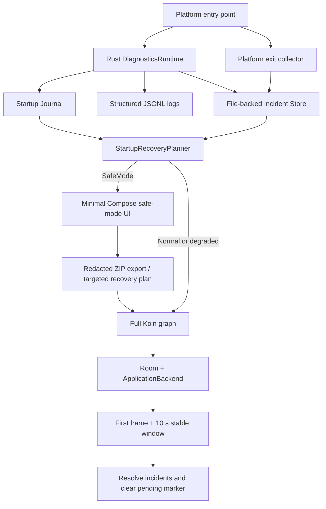

# Diagnostics and recovery architecture

TidePlayer keeps diagnostics local and starts a minimal Rust runtime before Koin, Room, the
application backend, playback, plugins, sources, or background work. This makes logs, incidents,
startup state, safe mode, and diagnostic export available even when normal startup cannot finish.



## Logs and incidents

Logs are high-volume, append-only JSONL events. Each event has a schema version, timestamp, explicit
level and category, target, message, optional detail/correlation ID, session and startup attempt IDs,
thread, platform, and allow-listed structured fields. Sessions are paged and searchable without
loading every event. The default retention policy is 7 days, 30 sessions, 50 MiB total, and 10 MiB
per session. The current session, incident-referenced sessions, and an active export are protected
from cleanup.

Incidents are durable fault records, not ordinary logs. Each incident lives in its own directory,
has an independent `incident.json`, and can have synchronized artifacts such as
`kotlin-crash.txt`, `rust-panic.txt`, `android-anr.txt`, or `platform-exit.json`. Incident storage
does not use Room. Normalized, redacted fingerprint material is SHA-256 hashed; repeated fingerprints
increment `occurrenceCount` rather than creating unlimited duplicate directories.

The on-disk layout is:

```text
<documents>/diagnostics/
├── logs/sessions/                 # JSONL session parts
├── logs/sessions.json             # atomic session manifest
├── incidents/<incident-id>/       # incident.json and artifacts
├── startup/                       # current, previous, history
├── state/                         # pending recovery, processed exits, recovery options
└── exports/                       # user-requested ZIP bundles
```

Legacy log files are migrated into the diagnostics tree on first use. Damaged JSONL lines are
skipped and returned as page warnings. Damaged atomic state is quarantined conservatively instead
of preventing startup.

## Startup Journal and safe mode

Every process gets a startup attempt and advances through:

```text
PROCESS_STARTED → PATHS_READY → DIAGNOSTICS_READY → PLATFORM_EXITS_COLLECTED
→ SETTINGS_LOADING → SETTINGS_READY → DATABASE_OPENING → DATABASE_READY
→ BACKEND_CREATING → BACKEND_READY → PLUGINS_LOADING → PLUGINS_READY
→ PLAYBACK_RESTORING → PLAYBACK_READY → SOURCE_TASKS_SCHEDULING
→ UI_COMPOSITION_STARTED → FIRST_FRAME_RENDERED → STARTUP_STABLE
→ SHUTDOWN_STARTED → SHUTDOWN_COMPLETE
```

Journal updates use temporary files, flush, and atomic rename. `STARTUP_STABLE` is written only
after the first Compose frame and a ten-second stable window. A clean shutdown records
`SHUTDOWN_COMPLETE` and `gracefulShutdown=true`. A prior unfinished attempt without a known crash
creates an `UNKNOWN_ABNORMAL_EXIT` warning, but Android user-requested exits matched to that attempt
are excluded. A single unknown exit does not force safe mode.

Automatic safe mode is selected for a pre-stable Kotlin/Rust/native fatal, database open or
migration failure, the same fatal fingerprint twice in ten minutes or three times in 24 hours, or
a recovery attempt that fails again at the same stage. A single stable ANR, low-memory termination,
playback failure, or unknown exit only warns. Plugin startup faults prefer a plugin-disabled normal
startup; source scheduling faults prefer automatic scan/background sync disabled. A user can also
request one safe-mode launch from the Diagnostics Center; the request marker is atomically consumed
by the next process.

Safe mode initializes only paths, diagnostics, platform exit collection, a minimal theme/language
snapshot, Compose recovery UI, file backup, and file sharing. It does not initialize Room
migrations, `ApplicationBackend`, player/DSP, queue restore, plugins, remote sync, scans, metadata
refresh, scheduled backup, or unrelated workers.

## Recovery transaction

The safe-mode UI can create raw recovery backups of settings and the unopened library database,
select one-time or persisted recovery overrides, clear cache, run a read-only SQLite
`integrity_check`, export diagnostics, and retry normal startup. Recovery overrides include
disabling plugins, clearing saved queue state, resetting DSP/audio effects, disabling automatic
scan, disabling remote sources, rebuilding the regenerable library index through the existing
`LibraryMaintenanceService`, and restoring default settings. Destructive choices require a
confirmation and never delete music files, playlists, favorites, or credentials by default.

The invariant is:

```text
RECOVERY_ATTEMPTED
→ apply selected recovery options
→ initialize database/backend/plugins/playback/sources
→ render first frame
→ complete ten-second stable window
→ mark incidents RESOLVED
→ clear pending recovery and recovery-options marker
```

Initialization failure never clears the pending marker.
Degraded automatic startup uses the same transaction: it records recovery before initializing, then
resolves the related incidents only after the normal UI completes the stable window.

## Platform capture matrix

| Capability | Android | iOS | Desktop |
| --- | --- | --- | --- |
| Structured file logs and Rust panic | Yes | Yes | Yes |
| Kotlin uncaught fatal hook | JVM default handler | Kotlin/Native unhandled hook | JVM default handler |
| Startup Journal and safe mode | Yes | Yes | Yes |
| Historical exit reasons | API 30+ `ApplicationExitInfo` | Unknown previous attempt only | Unknown previous attempt only |
| System ANR trace | API 30+, capped at 1 MiB | No | No |
| Native crash history | API 30+ platform exit record | No custom signal handler | No custom signal handler |
| ZIP sharing | `FileProvider` + `ACTION_SEND` | System share sheet | Open/save/reveal with OS fallback |

Android API 29 and below deliberately do not run a release watchdog or fabricate ANRs. iOS and
Desktop deliberately do not install unverified signal handlers.

## Diagnostic ZIP and privacy

Kotlin first collects the existing app/build/Git, database, source, track, scan, playback, storage,
and recent-error summaries and redacts them. Rust takes a consistent snapshot, redacts again, and
writes:

```text
manifest.json
summary.txt
environment.json
privacy-report.txt
startup/{current-attempt,previous-attempt,history}.json
incidents/incidents.json
incidents/<id>/{incident.json,artifacts...}
logs/{sessions.json,current-session.jsonl,previous-session.jsonl}
state/{playback,scan,plugin,source,storage}-summary.json
```

Single-incident export uses the same format with an incident ID allow-list. Bundles never include
the database, music, artwork, lyrics, audio cache, passwords, tokens, cookies, Authorization
headers, source secrets, or full credential-bearing URLs.

Redaction runs before log persistence and before ZIP output. It removes URL userinfo/query secrets,
Bearer/Basic credentials, cookies, tokens, passwords, API keys and plugin secrets; forbidden
structured field names are dropped. Home, app-document, cache, and known music-root paths are
replaced with symbolic roots. The known-root redaction registry is available before database startup
and is never added to an export. `privacy-report.txt` records the rules version and whether an ANR
trace, path summary, plugin ID, or remote host information is present.

## Debug fault injection

Android exposes fault injection only when the installed app is debuggable. iOS uses the Kotlin/Native
debug-binary flag. Desktop requires explicit developer mode:

```bash
MUSICAPP_DEVELOPER_MODE=true ./gradlew :desktopApp:run
```

The Diagnostics Center then shows confirmed actions for Kotlin uncaught failure, Rust panic, Android
ANR, database open/migration failure, plugin boot failure, playback backend failure, an incomplete
startup attempt, and a repeated fatal fingerprint. Release builds do not expose or execute these
controls. Android ANR injection blocks the real main thread and relies on the OS to classify the ANR.

See [diagnostics manual validation](../testing/diagnostics-manual-validation.md) for the end-to-end
procedures.

## Reference scope

[Halcyon](https://github.com/Kifranei/Halcyon) informed the session filtering, search, detail, copy,
retention, cleanup, and export interaction model. No Halcyon source was copied.

[NeriPlayer](https://github.com/cwuom/NeriPlayer) informed the product-level separation of crash
artifacts, pending recovery, pre-backend safe-mode planning, and Android historical ANR handling.
NeriPlayer is GPLv3; TidePlayer did not copy its Kotlin, C++, or other implementation code.
